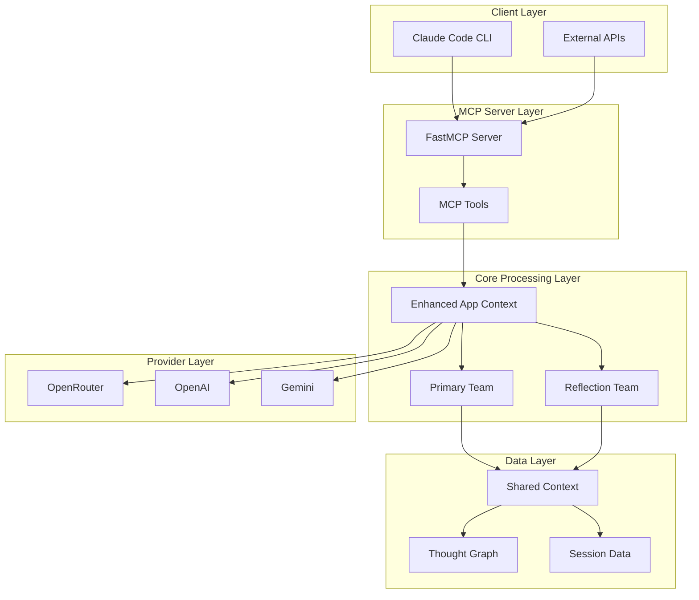
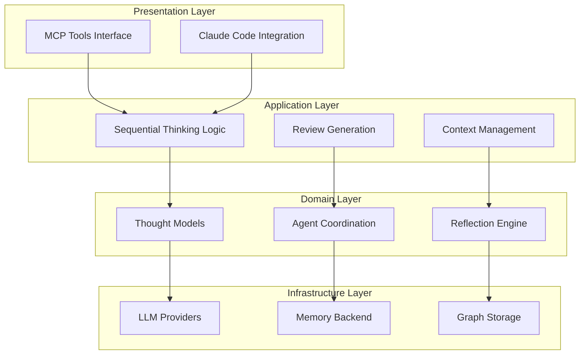
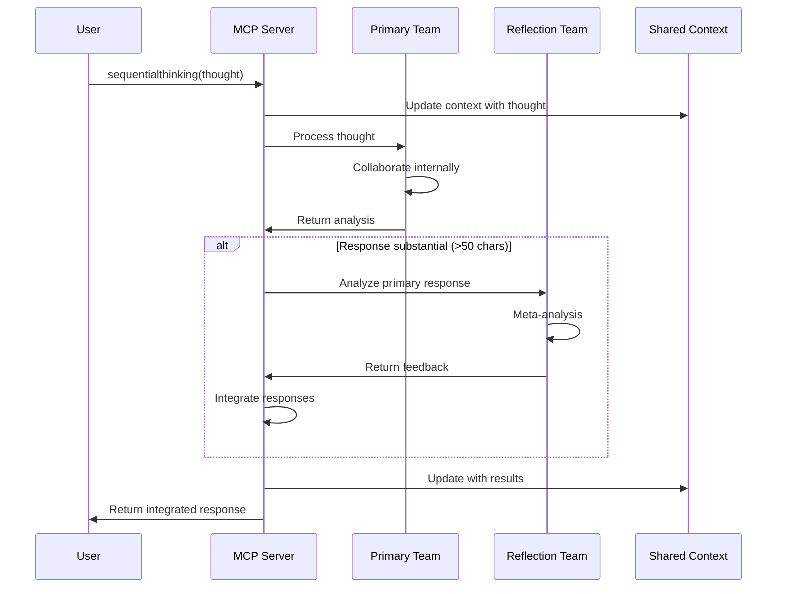
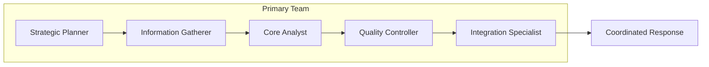
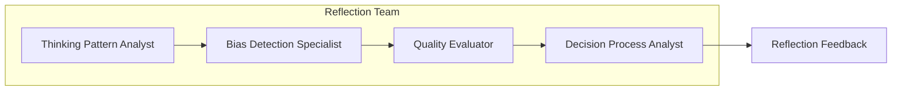
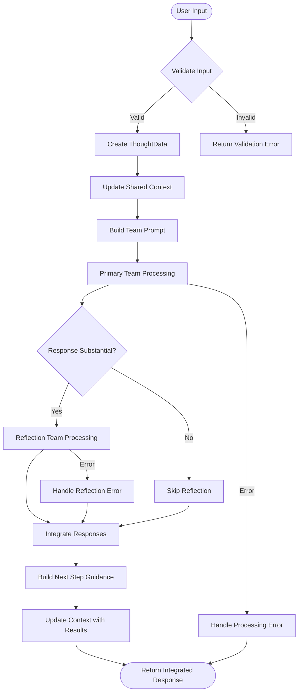
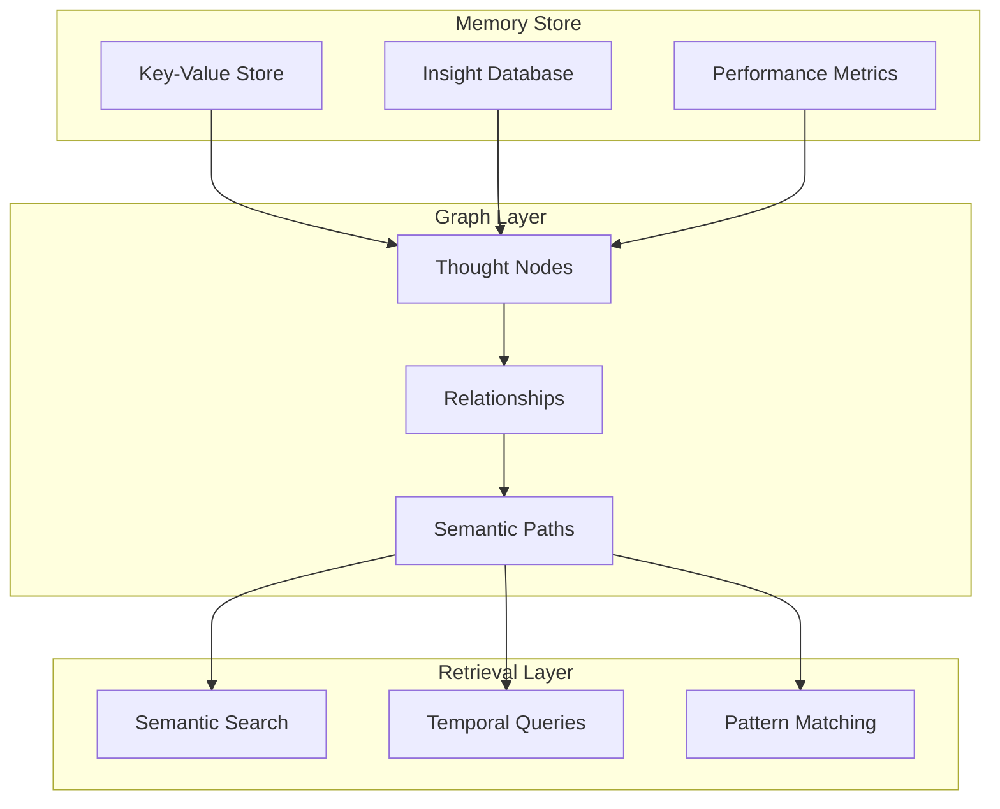
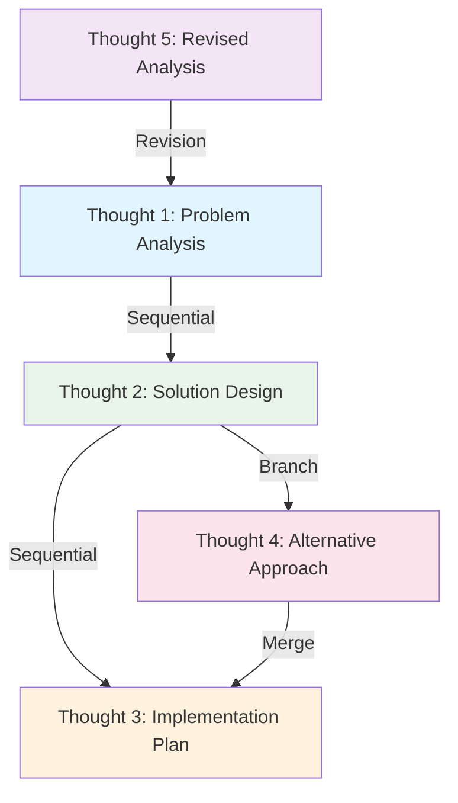
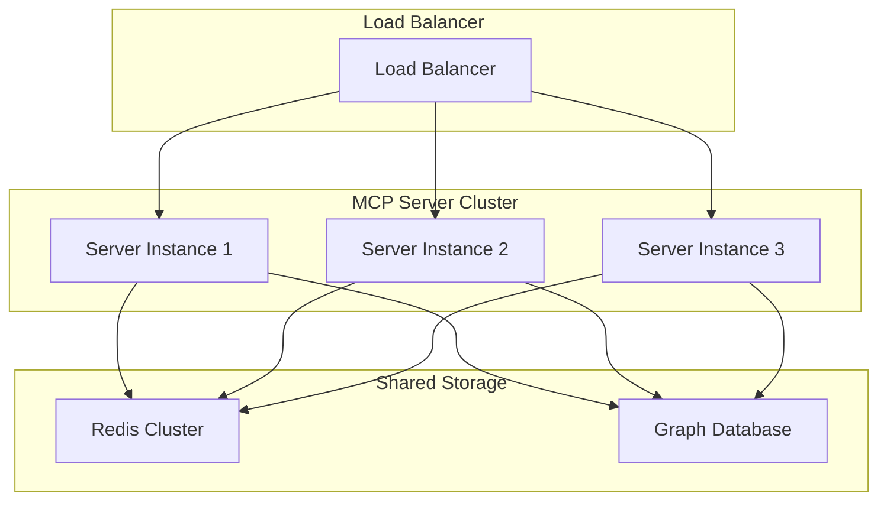

# Architecture Guide

Comprehensive architectural overview of the Reflective Sequential Thinking MCP Tool.

## Table of Contents

1. [System Overview](#system-overview)
2. [Core Architecture](#core-architecture)
3. [Dual-Team Design](#dual-team-design)
4. [Data Flow](#data-flow)
5. [Memory Management](#memory-management)
6. [Scalability Patterns](#scalability-patterns)
7. [Design Principles](#design-principles)

## System Overview

The Reflective Sequential Thinking MCP Tool implements a sophisticated multi-agent system that combines sequential reasoning with reflective analysis. The architecture is designed around the principle of **dual-perspective processing**, where every thought undergoes both primary analysis and meta-analytical reflection.

### High-Level Architecture



### Key Components

| Component | Purpose | Technology |
|-----------|---------|------------|
| **FastMCP Server** | MCP protocol implementation | FastMCP framework |
| **Dual Teams** | Primary + reflection processing | Agno multi-agent system |
| **Shared Context** | Persistent memory management | NetworkX + async patterns |
| **Thought Models** | Type-safe data structures | Pydantic v2 |
| **Provider Factory** | LLM abstraction layer | Factory pattern |

---

## Core Architecture

### Layered Architecture Pattern

The system follows a **layered architecture** with clear separation of concerns:



#### Layer Responsibilities

**Presentation Layer:**
- MCP tool interfaces (`sequentialthinking`, `sequentialreview`)
- Input validation and output formatting
- Error handling and user feedback

**Application Layer:**
- Core business logic for thought processing
- Session management and state coordination
- Inter-team communication orchestration

**Domain Layer:**
- Rich domain models with validation
- Agent behavior and team coordination
- Reflection algorithms and patterns

**Infrastructure Layer:**
- LLM provider abstractions
- Persistence mechanisms
- External service integrations

---

## Dual-Team Design

### Conceptual Foundation

The dual-team architecture implements **System 1 vs System 2 thinking**:

- **Primary Team (System 1)**: Fast, intuitive, direct analysis
- **Reflection Team (System 2)**: Slow, deliberate, meta-analytical



### Primary Team Composition



**Role Descriptions:**

- **Strategic Planner**: Breaks down problems into manageable components
- **Information Gatherer**: Collects relevant context and background
- **Core Analyst**: Performs deep analytical processing
- **Quality Controller**: Validates reasoning and identifies gaps
- **Integration Specialist**: Synthesizes findings into coherent output

### Reflection Team Composition



**Role Descriptions:**

- **Thinking Pattern Analyst**: Examines cognitive processes and reasoning chains
- **Bias Detection Specialist**: Identifies cognitive biases and blind spots
- **Quality Evaluator**: Assesses completeness, accuracy, and depth
- **Decision Process Analyst**: Reviews tool choices and decision rationale

---

## Data Flow

### Thought Processing Pipeline



### Context Update Flow

```mermaid
flowchart LR
    subgraph "Input Processing"
        A1[New Thought] --> A2[Validate Data]
        A2 --> A3[Extract Keywords]
        A3 --> A4[Determine Domain]
    end
    
    subgraph "Graph Operations"
        B1[Add Node] --> B2[Create Relationships]
        B2 --> B3[Update Paths]
        B3 --> B4[Check Cycles]
    end
    
    subgraph "Context Enrichment"
        C1[Semantic Analysis] --> C2[Pattern Detection]
        C2 --> C3[Insight Generation]
        C3 --> C4[Performance Tracking]
    end
    
    A4 --> B1
    B4 --> C1
    C4 --> D1[Updated Context]
```



---

## Memory Management

### Shared Context Architecture

The shared context system implements a **graph-based memory model** with semantic retrieval:



### Context Persistence Strategies

#### Memory Backend (Default)
```python
class MemoryBackend:
    """In-memory storage with thread-safe operations."""
    
    async def store(self, key: str, value: Any) -> None:
        async with self._lock:
            self._storage[key] = value
    
    async def retrieve(self, key: str) -> Optional[Any]:
        async with self._lock:
            return self._storage.get(key)
```

#### Redis Backend (Optional)
```python
class RedisBackend:
    """Redis-backed storage for production deployments."""
    
    async def store(self, key: str, value: Any) -> None:
        serialized = pickle.dumps(value)
        await self._redis.set(key, serialized)
    
    async def retrieve(self, key: str) -> Optional[Any]:
        data = await self._redis.get(key)
        return pickle.loads(data) if data else None
```

### Graph-Based Relationships

The system maintains a **directed graph** of thought relationships:



**Relationship Types:**
- **Sequential**: Natural progression (T1 → T2)
- **Revision**: Improvement of previous thought (T5 → T1)
- **Branch**: Alternative exploration (T2 → T4)
- **Merge**: Integration of branches (T4 → T3)

---

## Scalability Patterns

### Horizontal Scaling



#### Session Affinity Strategy
```python
class SessionManager:
    """Manages session routing for stateful operations."""
    
    def get_server_for_session(self, session_id: str) -> str:
        # Consistent hashing for session affinity
        hash_value = hashlib.md5(session_id.encode()).hexdigest()
        server_index = int(hash_value[:8], 16) % len(self.servers)
        return self.servers[server_index]
```

### Vertical Scaling

#### Resource Optimization
- **Connection Pooling**: Reuse LLM provider connections
- **Async Processing**: Non-blocking I/O operations
- **Memory Efficiency**: Streaming for large contexts
- **CPU Optimization**: Parallel team processing

```python
# Example: Parallel team processing
async def process_teams_parallel(thought_data: ThoughtData) -> ProcessedThought:
    # Start both teams concurrently
    primary_task = asyncio.create_task(primary_team.arun(primary_prompt))
    
    # Reflection starts with slight delay for better coordination
    await asyncio.sleep(0.5)
    reflection_task = asyncio.create_task(reflection_team.arun(reflection_prompt))
    
    # Wait for both to complete
    primary_result, reflection_result = await asyncio.gather(
        primary_task, reflection_task, return_exceptions=True
    )
    
    return integrate_results(primary_result, reflection_result)
```

---

## Design Principles

### 1. Separation of Concerns

Each component has a **single, well-defined responsibility**:
- **Models**: Data structure and validation
- **Agents**: Specialized reasoning capabilities
- **Teams**: Coordination and orchestration
- **Context**: Memory and state management
- **Providers**: External service abstraction

### 2. Fail-Safe Degradation

The system continues operating even when components fail:
- **Reflection Optional**: Primary team can work alone
- **Provider Fallback**: Multiple LLM providers supported
- **Partial Results**: Return available analysis if complete processing fails
- **Error Recovery**: Automatic retry with exponential backoff

### 3. Extensibility

New capabilities can be added without modifying core components:
- **Plugin Architecture**: New agents can be added to teams
- **Provider Plugins**: New LLM providers via factory pattern
- **Tool Extensions**: Additional MCP tools through registration
- **Context Backends**: Alternative storage mechanisms

### 4. Type Safety

Complete type coverage ensures reliability:
- **Pydantic Models**: Runtime validation with type hints
- **Generic Types**: Parameterized types for flexibility
- **Protocol Definitions**: Interface contracts
- **Async Type Support**: Proper async/await typing

### 5. Observability

Comprehensive monitoring and debugging capabilities:
- **Structured Logging**: Machine-readable log formats
- **Performance Metrics**: Execution time and resource usage
- **Error Tracking**: Detailed error context and stack traces
- **Context Inspection**: Full context state export/import

### 6. Security

Defense-in-depth security approach:
- **Input Validation**: Strict input sanitization
- **Context Isolation**: Session-based context separation
- **Provider Security**: Secure credential management
- **Audit Logging**: Complete operation history

---

## Performance Characteristics

### Latency Profile

| Operation | Typical Latency | Notes |
|-----------|----------------|-------|
| Single Thought | 2-5 seconds | Depends on LLM provider |
| With Reflection | 4-8 seconds | Includes meta-analysis |
| Context Update | <100ms | In-memory operations |
| Sequential Review | 1-3 seconds | Graph analysis + LLM |

### Memory Usage

| Component | Memory Usage | Scaling Factor |
|-----------|-------------|----------------|
| Thought Graph | ~1KB per thought | Linear with thought count |
| Shared Context | ~10-50MB | Based on session size |
| Team Models | ~500MB-2GB | Depends on LLM provider |
| Total System | ~1-3GB | Production deployment |

### Optimization Strategies

1. **Context Pruning**: Remove old contexts based on TTL
2. **Response Caching**: Cache similar prompts and responses
3. **Model Optimization**: Use smaller models for simple tasks
4. **Async Coordination**: Overlap processing where possible
5. **Resource Pooling**: Share connections and models

This architecture enables the system to handle complex reasoning tasks while maintaining reliability, scalability, and extensibility.